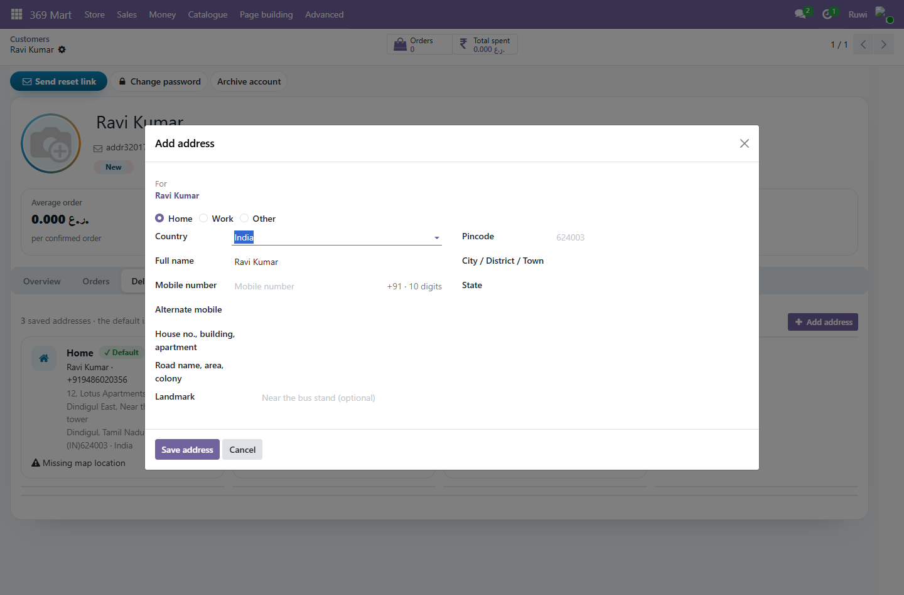
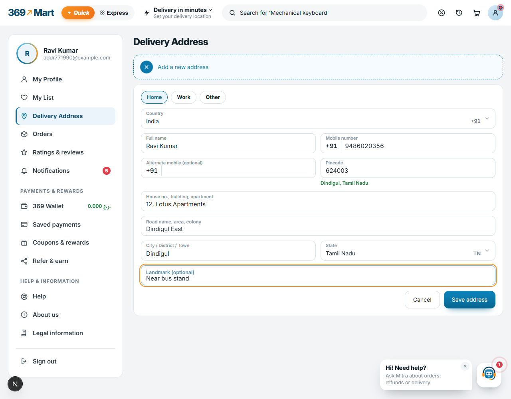
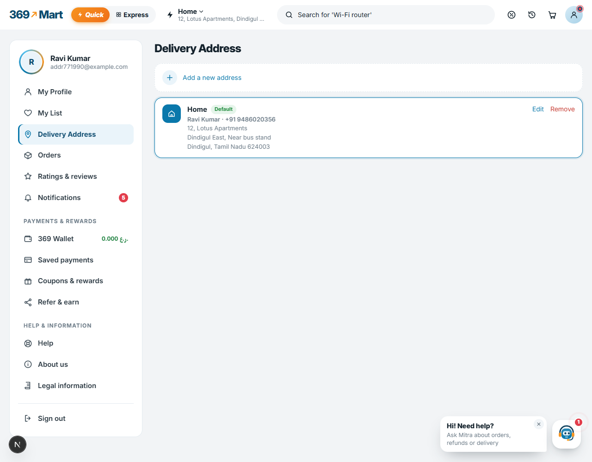
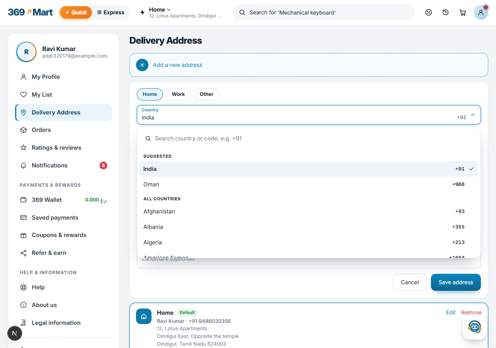
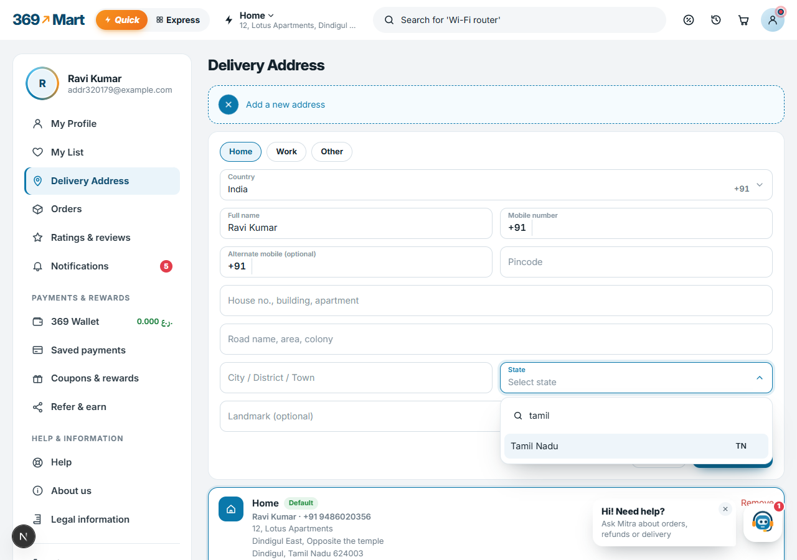
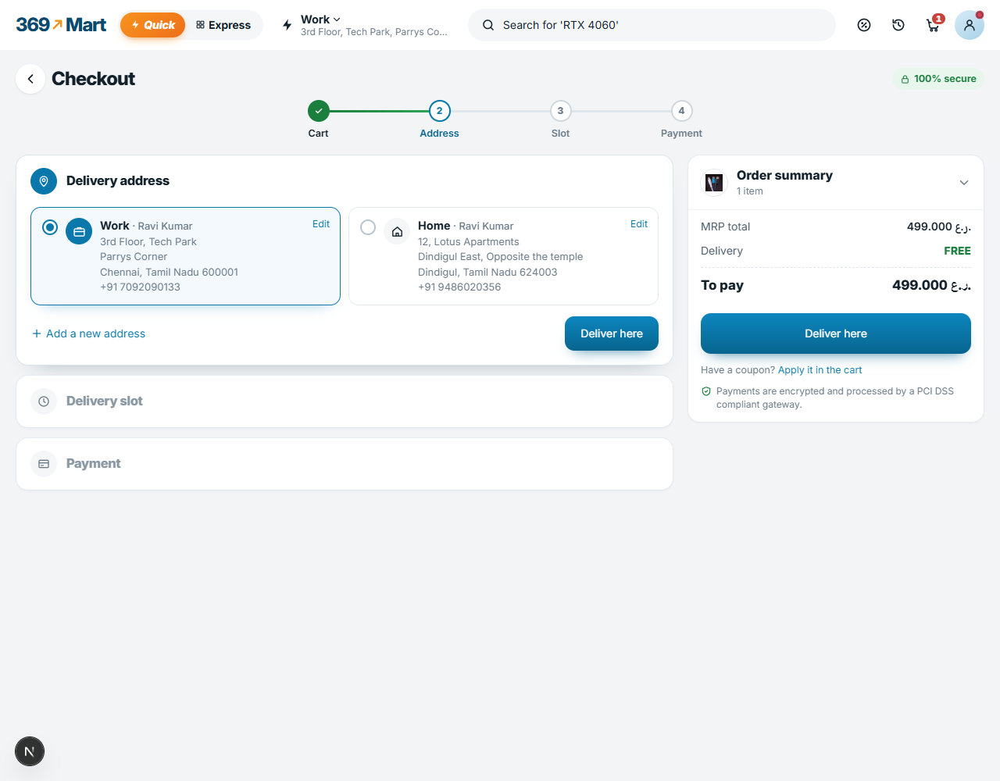

# 369 Mart Delivery Addresses (`mart369_address`)

Customers keep several delivery addresses. The app asks the phone for its
location, turns that into an area, city, state and pincode, and the customer
fills in the rest — flat, name, mobile, and whether it is Home or Work.

An address is an ordinary Odoo **delivery contact under the customer**, so sale
orders, delivery and invoicing all understand it. No new model.

## For staff

**369 Mart → Customers**, then open a customer and go to **Delivery addresses**.
Each address shows as a card with its Home / Work chip, the green *Default*
badge, and a *Make default* button on the others. Anything incomplete — no
mobile, no pincode, no street, no map location — is called out on the card.

**369 Mart → Addresses** is every address from every customer at once: a board
of the same cards, a list with the same warnings in a *Missing* column, and
Odoo's own search, grouping (by customer, city or type) and export.

Both screens use `mart369_auth`'s stylesheet, so they and the Customers screen
are one design.

**+ Add address** and **Edit** open the same form the shop uses. The
customer's own mobile is filled in only when it belongs to the address's
country - an Omani +968 number is never offered on an Indian address - and
changing the country drops a number from another one.

## For customers

The storefront has one address form, used in Checkout and in Account →
Delivery Address. It works like Flipkart and Amazon:

- **Home / Work / Other** pills.
- A searchable **Country** picker (type a name, code or "+91"; suggested countries first), starting on the customer's own country, else India. The
  country decides the rest: the phone prefix (+91, +968 …), the list of states
  and the pincode length. An address in Tamil Nadu gets a +91 number even though
  the shop's companies are in Oman.
- One box per line: full name, mobile, alternate mobile, pincode, house no. /
  building / apartment, road / area / colony, landmark, city / district / town,
  state. Name and mobile are filled in from the account.
- For India, typing the pincode fills in the city and state and suggests the
  post-office areas (India Post's free API, asked by Odoo and cached per
  pincode). What the shopper typed themselves is never overwritten.
- Every saved address has **Edit**. "Use my current location" opens this form
  filled in, for the shopper to add the flat number and check.

## The API

Called by the storefront's own server, not the browser. All `auth='user'`
except geocoding.

| Route | Does |
|---|---|
| `GET /369mart/addresses` | the customer's addresses, which is selected, and what the phone field should show |
| `GET /369mart/addresses/form?country=IN` | what the form needs for one country: phone prefix and length, pincode length, states, and every country for the picker |
| `POST /369mart/addresses` | add one; the first becomes the default. Needs name, phone, line, area, town, pin and (where the country has them) state_id |
| `PATCH /369mart/addresses/<id>` | change one |
| `DELETE /369mart/addresses/<id>` | archive one (past orders keep theirs) |
| `POST /369mart/addresses/<id>/default` | choose the delivery address |
| `POST /369mart/geocode/reverse` | `{lat, lng}` → area, city, state, pincode |
| `GET /369mart/pincode/<pin>` | Indian pincode → town, state and post-office areas (public, cached) |

An address comes back with its lines apart (`line`, `area`, `landmark`, `town`,
`pin`, `state_id`, `country_code`) and, for older screens, `city` still joined
as "Dindigul 624003". Older callers may still send that joined `city`.

A customer can only ever reach their own addresses: every route resolves the id
through one helper that requires the address to hang off their partner, and
answers 404 otherwise.

## Mobile numbers

The rule is not written down anywhere — it follows the address's country, via
Google's libphonenumber. India means +91, ten digits, starting 6-9; Oman means
+968 and eight digits. A landline is refused even where it is a "valid" number.

The helper lives in `mart369_auth` (`res.partner._mart369_check_mobile`), because
signup collects a mobile too.

## Geocoding

Odoo's own `base_geolocalize` calling OpenStreetMap Nominatim — **no API key and
no billing**. Nominatim asks for about one request a second, so answers are
cached per rounded coordinate. Odoo blocks these calls inside tests, so the test
stubs the reply and checks the mapping.

## Tests

`odoo-bin -d <db> --test-enable --test-tags=/mart369_address --stop-after-init`
