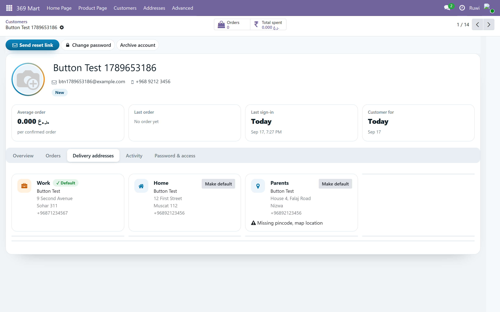
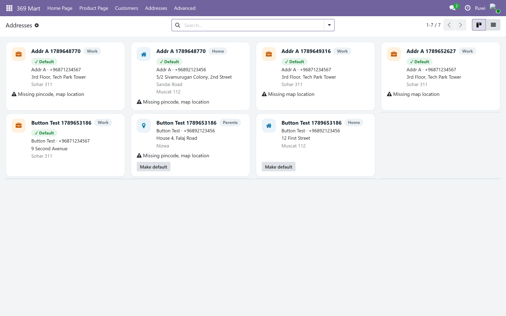
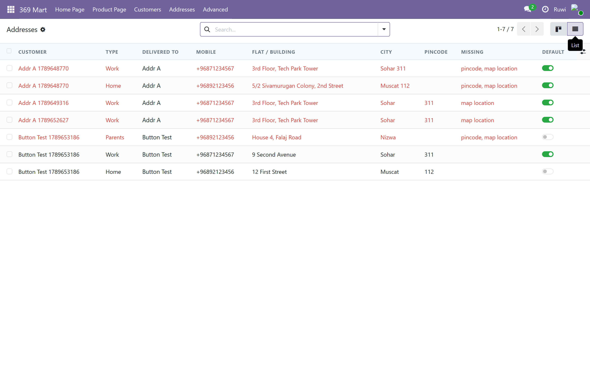

# 369 Mart Delivery Addresses (`mart369_address`)

Customers keep several delivery addresses. The app asks the phone for its
location, turns that into an area, city, state and pincode, and the customer
fills in the rest — flat, name, mobile, and whether it is Home or Work.

An address is an ordinary Odoo **delivery contact under the customer**, so sale
orders, delivery and invoicing all understand it. No new model.

## For staff

**369 Mart → Customers**, then open a customer and go to **Delivery addresses**.
Each address shows as a card with its Home / Work chip, the green *Default*
badge, and a *Make default* button on the others. Anything incomplete — no
mobile, no pincode, no street, no map location — is called out on the card.

**369 Mart → Addresses** is every address from every customer at once: a board
of the same cards, a list with the same warnings in a *Missing* column, and
Odoo's own search, grouping (by customer, city or type) and export.

Both screens use `mart369_auth`'s stylesheet, so they and the Customers screen
are one design.

## The API

Called by the storefront's own server, not the browser. All `auth='user'`
except geocoding.

| Route | Does |
|---|---|
| `GET /369mart/addresses` | the customer's addresses, which is selected, and what the phone field should show |
| `POST /369mart/addresses` | add one; the first becomes the default |
| `PATCH /369mart/addresses/<id>` | change one |
| `DELETE /369mart/addresses/<id>` | archive one (past orders keep theirs) |
| `POST /369mart/addresses/<id>/default` | choose the delivery address |
| `POST /369mart/geocode/reverse` | `{lat, lng}` → area, city, state, pincode |

A customer can only ever reach their own addresses: every route resolves the id
through one helper that requires the address to hang off their partner, and
answers 404 otherwise.

## Mobile numbers

The rule is not written down anywhere — it follows the country Odoo has, via
Google's libphonenumber. India means +91, ten digits, starting 6-9; Oman means
+968 and eight digits. A landline is refused even where it is a "valid" number.

The helper lives in `mart369_auth` (`res.partner._mart369_check_mobile`), because
signup collects a mobile too.

## Geocoding

Odoo's own `base_geolocalize` calling OpenStreetMap Nominatim — **no API key and
no billing**. Nominatim asks for about one request a second, so answers are
cached per rounded coordinate. Odoo blocks these calls inside tests, so the test
stubs the reply and checks the mapping.

## Tests

`odoo-bin -d <db> --test-enable --test-tags=/mart369_address --stop-after-init`
