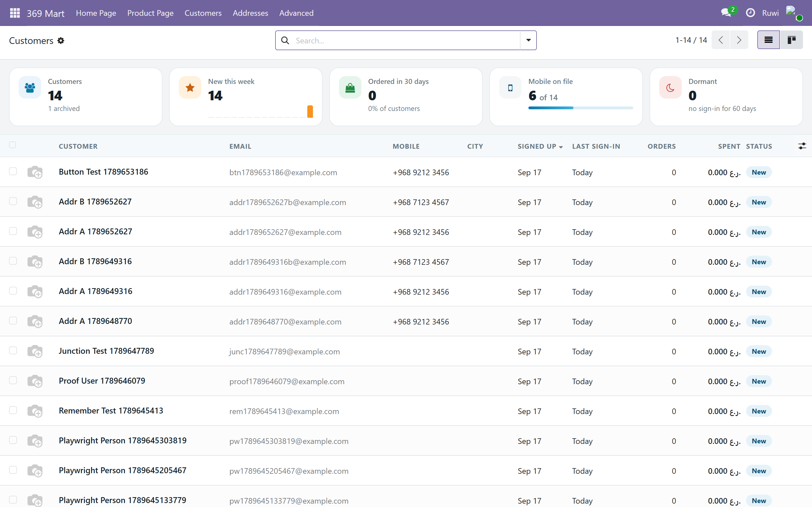
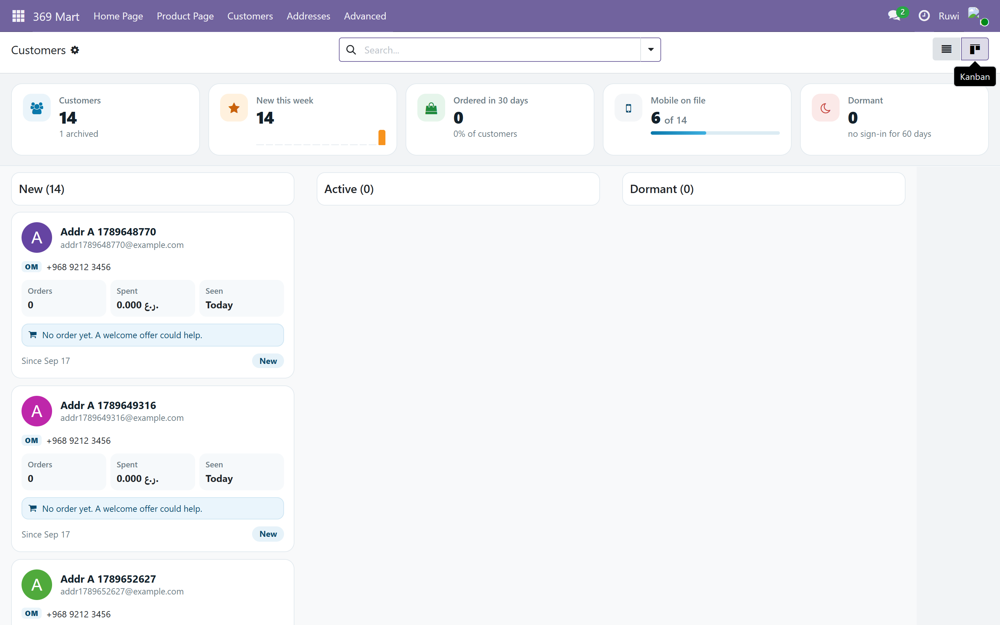
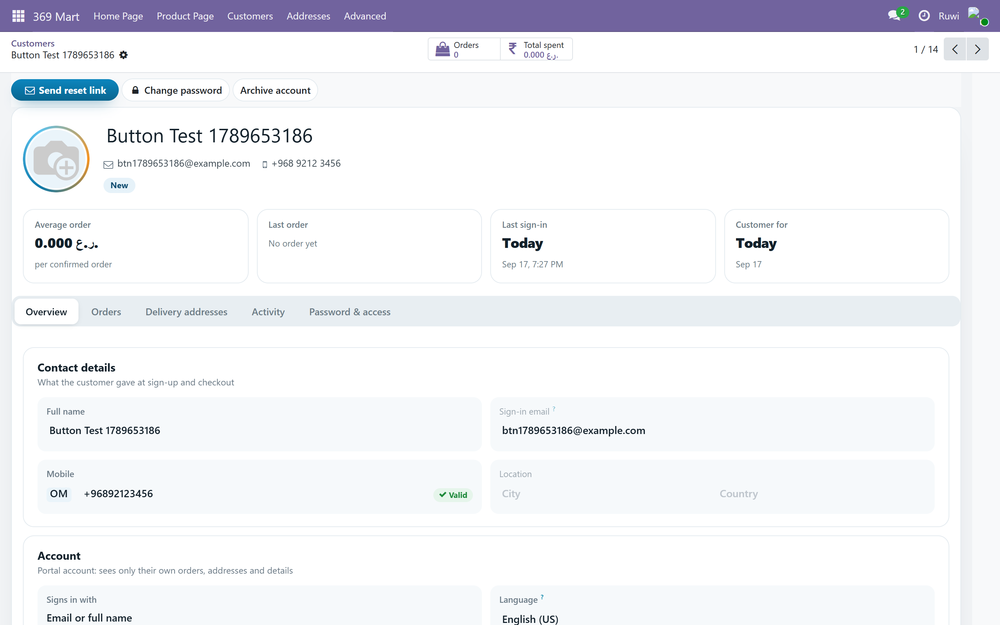
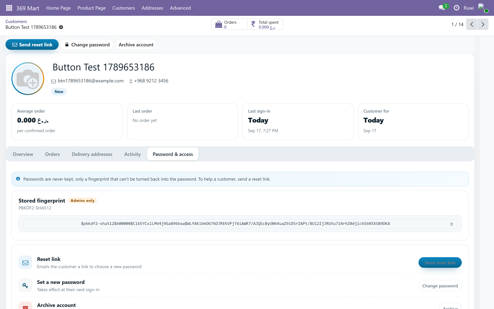

# 369 Mart Sign In (`mart369_auth`)

Customers create their own account on the storefront and sign in with their
**name or email** plus a password. Nothing to configure: installing the module
turns on free sign up.

Every account made this way is a **portal user**. It sees its own orders,
addresses and details and nothing else, and it cannot open the Odoo backend.
See who has signed up under **369 Mart → Customers**.

## The Customers screen

Styled like the storefront (navy / ocean blue / orange, rounded cards, pill buttons).

- **List** (default): a numbers strip on top — customers, new this week (with a
  14-day sign-up chart), ordered in 30 days, mobile on file, dormant. Click a tile
  to filter. One row per customer: avatar, name, email, mobile, city, signed up,
  last sign-in, orders, spent, status.
- **Board**: cards grouped New / Active / Dormant, with a follow-up hint on new
  customers without an order and on dormant ones.
- **Profile**: avatar, contact line and status; totals (orders, spent, average
  order, last order, last sign-in, customer for); tabs for Overview, Orders,
  Delivery addresses, Activity (sign-ins and orders) and Password & access
  (reset link, change password, archive).

Status: *New* = signed up in the last 7 days, *Dormant* = no sign-in for 60 days,
*Archived* = sign-in blocked, everyone else *Active*. Refreshed at every sign-in
and by the daily job "369 Mart: refresh customer status".

A mobile typed on the profile is checked for the customer's country and saved
as +919847021536; a landline or wrong length is refused.

## The routes

All under `/369mart/auth/`, JSON in and out, called by the storefront's own
server (`app/api/auth/*`), never straight from a browser.

| Route | Body | Answer |
|---|---|---|
| `POST signup` | `{name, email, password}` | `201 {ok, name, email}` and the session cookie, or `{ok:false, error, field}` |
| `POST login` | `{login, password}` — email or full name | `200 {ok, name, email}` and the session cookie, or `401` |
| `POST logout` | — | `{ok:true}` |
| `GET  me` | — | `{ok, name, email, phone, partner_id}` or `401` |
| `POST forgot` | `{email}` | always `{ok:true}` |

## Why the login is the email

`res.users.login` must be unique and full names are not — two Arun Kumars
would block the second sign up. So the email is the login and the name is the
name. Signing in by name works whenever the name is unique; if two accounts
share it the answer asks for the email instead.

## Needs

- An **outgoing mail server** in Odoo, or "Forgot password" answers ok but
  sends nothing.
- The server must know its database (`-d` or `dbfilter`), as for `mart369_home`.

## Tests

`odoo-bin -d <db> --test-enable --test-tags mart369_auth --stop-after-init`
