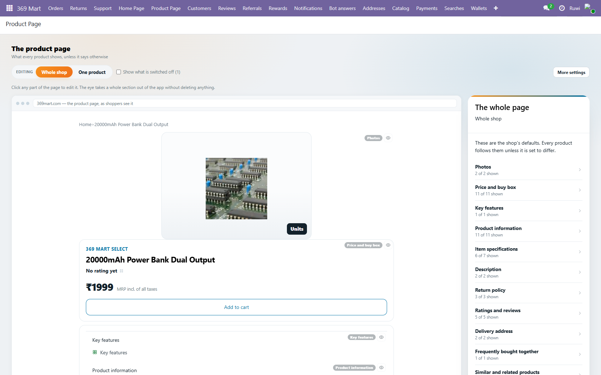
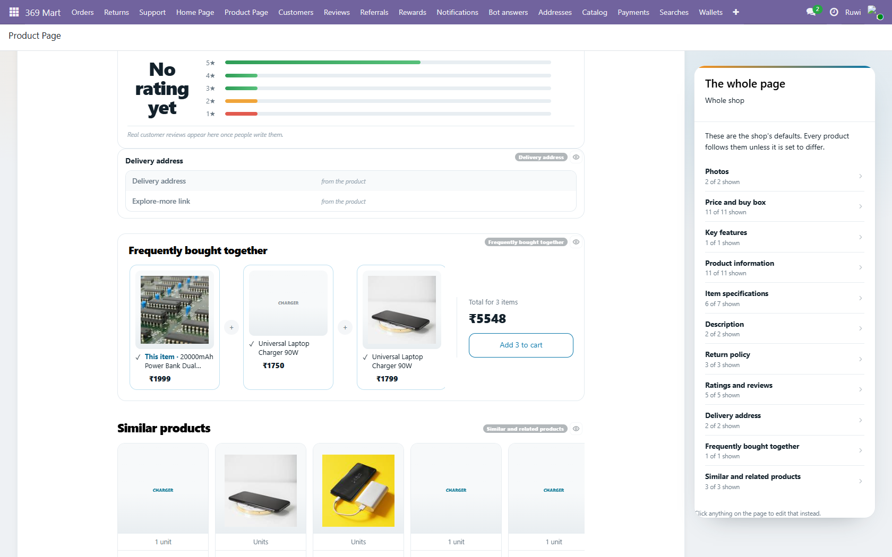
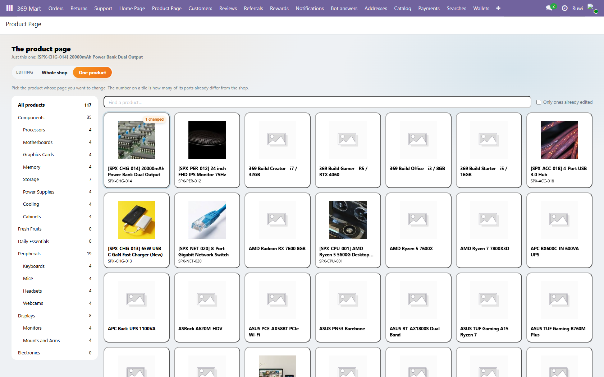
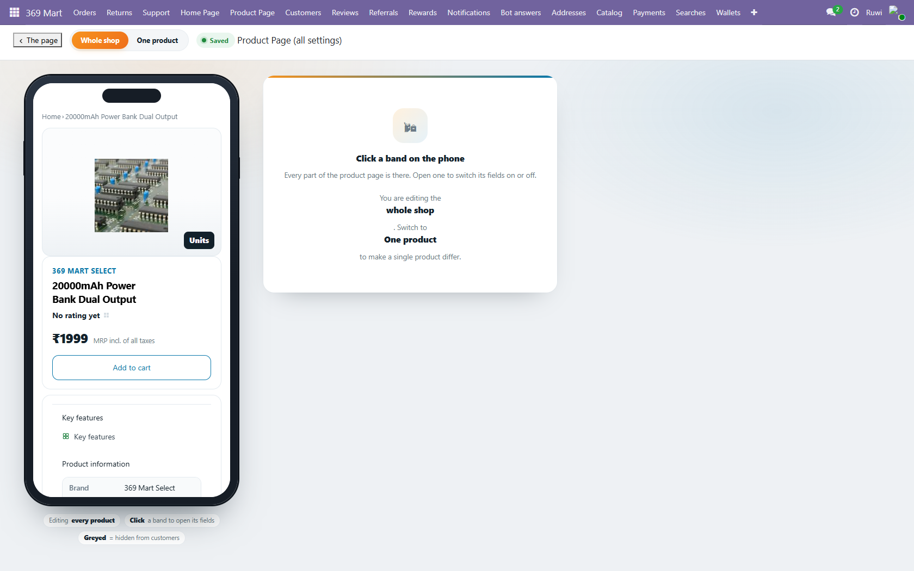

# 369 Mart Product Page (`mart369_product`)

The product page in the app shows about fifty things. This module decides
**which of them a customer actually sees**, and where the wording comes from.

Edit it in **369 Mart → Product Page**: the real page, wide, with a switch on
everything. The app reads the result from `GET /369mart/product/<id>`.



Below the fold it draws the real rails — bought-together with its running
total, and the similar / related rows — rather than a line saying how many are
shown. They come from `builder_load`'s `preview`, which exists so this canvas
never has to invent a product:



Choosing **One product** opens the shop to browse:



And "More settings" is the same page in a phone frame, with every field of
every section listed at once:



## The two screens

The same page, at two levels of detail — the same split the home page makes.

| | |
|---|---|
| **The editor** `/odoo/mart-product` | The front door. The page as shoppers see it, on a wide canvas. Click a part of it to open its fields, open a field to edit it. `static/src/builder/editor.js` |
| **All settings** `/odoo/mart-product-advanced` | Behind the editor's "More settings". The same page in a phone frame, with every field of every section listed at once. `static/src/builder/product_builder.js` |

They are not two drawings of the page. Both read the same `builder_load`
through `ProductPageReader` (`static/src/builder/page_reader.js`) and draw the
same markup through `mart369_product.PageBody`
(`static/src/builder/page_reader.xml`), passing in their own band wrapper —
`.pe-band` for the editor, `.mart-band` for the phone. A section that appears
on one therefore appears on the other, by construction.

Their chrome lives in `mart369/static/src/builder/builder.scss`, next to the
home page's, because the tours assert on those class names.

> The editor took `/odoo/mart-product` from the phone builder in 19.0.1.3.0.
> Because a write is not flushed before the create that wants the freed path,
> that handover needs `migrations/19.0.1.3.0/pre-migrate.py` — file order
> alone is not enough, and without it the upgrade rolls back on
> `ir_act_client_path_unique`.

## Finding the product

"One product" opens the shop to browse, not a search box. The rail is the
shop's own `product.public.category` tree with a count on every branch, plus an
**Uncategorised** bucket — without it the products filed under no category are
in the shop and in no list, and unreachable from this screen. There is a search
box over name and internal reference, and an **only ones already edited**
filter for "what has somebody changed?".

One call behind it, `product.template.mart369_page_picker()`, shared by both
surfaces: Odoo's editor reaches it over ORM, the console over
`GET /369mart/admin/product/catalog`.

Two things it gets right that are easy to get wrong:

* **A parent category uses `child_of`.** "Computers" is a heading, not a
  shelf; nothing is filed directly against it, so an equality test shows an
  empty grid next to a count of one.
* **The counts roll up through `parent_path`**, from a single read of every
  published product's categories. Counting per category is one query each
  *and* makes a parent read 0 while clicking it shows dozens.

It is built on plain `product.public.category` fields on purpose.
`mart369_catalog` has nicer helpers (`_mart369_product_domain`, `mart_in_app`),
but it is not in this module's `depends`, and every 369 Mart module installs on
its own. The cost is that the rail lists categories the storefront's nav hides
— which is right here: this groups products so you can find one, it does not
mirror the app's navigation.

One ordering rule in `editor.js`: `pickProduct` loads the new product **before**
it leaves the picker. The other way round re-renders the editor the moment the
flag flips, which draws the *previous* product's page until the new one lands —
so tapping a tile flashed up the wrong product, name in the toolbar and all.

## The two switches

| | |
|---|---|
| **Whole shop** | one switch per field. The default for every product. |
| **One product** | *Follow the default* / *Always show* / *Always hide*. |

A product only deviates where an employee chose to, and **following stores
nothing** — so switching a field off shop-wide later still reaches every
product that follows. That is the whole point of the three states: hiding is
a switch, and a product opting out is a deliberate, visible exception (the
panel marks it *differs* and offers *put back*).

Sections are a master switch: turn *Product information* off and none of its
eleven fields show, whatever they say individually.

## Where a value comes from

Three places, in order — **the product**, then **its category**, then **the
shop default**:

```
Shop default:       Sold by → 369 Mart Retail
Fresh Fruits:       Return  → 24-hour freshness replacement
                    Shelf   → 3-5 days, refrigerated
Shimla Apple 1 kg:  (inherits both, overrides nothing)
```

Set the shop default in the builder, the category one under **Advanced →
Wording by Category**, and the per-product one on the product itself. Fresh
fruit and headphones genuinely differ, which is why the category layer exists
— otherwise the same sentence gets typed onto two hundred products.

## What lives where

- `mart369.product.section` — the eleven bands of the page.
- `mart369.product.field` — the catalogue, one row per thing the page can
  show. `show` is the shop-wide switch. **Add a row and it appears in the
  builder with its own switch — no developer needed.** Generated by
  `tools/gen_fields_xml.py`; edit the table there and re-run.
- `mart369.product.category.value` — wording for one category. Sparse.
- `mart369.product.override` — one product deviating. Sparse: **a product
  that follows everywhere has no rows at all.**
- `mart369.product.page` — assembles the payload. On a model rather than in
  the controller so the tests and the builder share one code path.

Deliberately **not** a `fields.Json` blob on the product: Odoo 19's `Json`
cannot be searched, and is deep-copied on read so `product.vis['x'] = 'hide'`
silently does nothing. Sparse rows keep *"which products hide the
manufacturer address?"* a real domain.

## Reviews are real

`product.template` inherits `rating.mixin`, so the page shows genuine customer
reviews. Read straight off `rating.rating` with `sudo()` — `rating_avg` is
restricted to internal users and would silently read as **zero** on a public
route. Only `consumed=True`, `is_internal=False`, `rating >= 1` count: the
rest are access-token placeholders and internal notes. With none yet the
endpoint sends `reviews: []` and the page says so rather than inventing any.

## Running the tests

```
odoo-bin -c odoo.conf -d <db> -u mart369_product --test-enable --test-tags=/mart369_product --stop-after-init
```

Windows notes are in `mart369_home/README.md` (the `MSYS_NO_PATHCONV=1`
prefix, the `--do-not-de-elevate` wrapper for tours, and never running a tour
in the same command as `-u`).

**One more, learned the hard way:** Windows lets several processes bind the
same port. Killing "the PID on port 8097" leaves the others answering with
stale code, and you will chase a bug that was fixed twenty minutes ago. Sweep
by command line:

```
Get-CimInstance Win32_Process -Filter "Name='python.exe'" |
  ? { $_.CommandLine -match 'http-port=8097' } | % { Stop-Process -Id $_.ProcessId -Force }
```

## The mock's stylesheet

`static/src/scss/storefront_pdp.scss` is generated from the storefront's own
CSS by `tools/gen_pdp_scss.py` — **do not hand-edit it**. The product page's
styles live in four files, not one (`product.css`, plus blocks in
`browse.css` and `acx.css`); `home.css` is not copied because
`mart369_home`'s `storefront.scss` already ships it and carries the `--hm-*`
tokens these rules read.

Re-run the generator after any storefront CSS change, then compile-check it
the way Odoo will:

```
python tools/gen_pdp_scss.py
python -c "import io,sass; sass.compile(string=io.open('static/src/scss/storefront_pdp.scss',encoding='utf-8').read()); print('ok')"
```

The generator refuses to write unbalanced braces, and rewrites `min()`/`calc()`
through interpolation because libsass implements `min()` itself and rejects a
`calc()` inside it — which blanks every Odoo page with *"Style error"*.

## Out of scope

- **Reordering sections.** The storefront draws them in a fixed order;
  changing that needs a `layout` array in the API *and* a change to
  `ProductDetail.jsx`.
- **`/cancellation-policy`** is linked from the return policy and **does not
  exist** on the storefront — both it and `Cart.jsx` land on the 404 page. The
  link target is configurable here (*View-policy link*), so either point it at
  a real page or create that route.
- **Wiring the storefront to this endpoint.** `app/product/[id]/page.jsx`
  fetches nothing today; it looks the product up in a client-side index.
